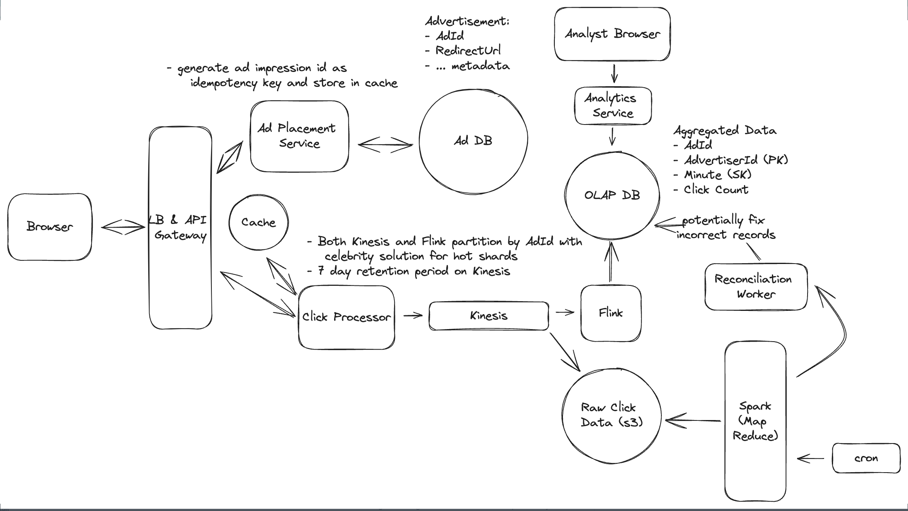

# Topics to cover
### Support 10K qps
  - Event stream (Kinesis or Kafka)
  - Even processing (Flink) to move data into an analytics DB
  - Alternatively, have an aggregation pipeline that caches the total

### Accuracy
  - Use durable message queue
  - Dump raw data from the event stream into durable storage
  - Periodically verify the aggregated counts against the raw data

### Avoid abuse
  - Assign a unique id with signing for verification
