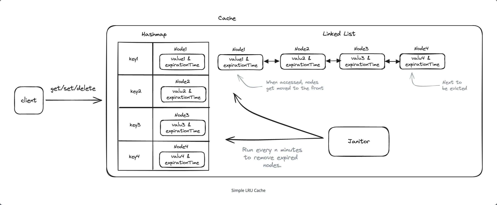

# Topics to cover

### Support key TTL
  - Backgrond process to clean up expired keys

### LRU eviction policy
  - Hashmap and linked list

### Availability and fault tolerance
  - Sync or async replication
  - Quorums

### Scalability
  - Shard or partition keys
  - Consistent hashing

### Hot keys
  - Copy to mutiple shards for reads
  - Batch updates or split the key across partitions (e.g. counter)

### Node failures
  - Gossip or coordinator (e.g. zookeeper)

[Source](https://www.hellointerview.com/learn/system-design/problem-breakdowns/distributed-cache)
