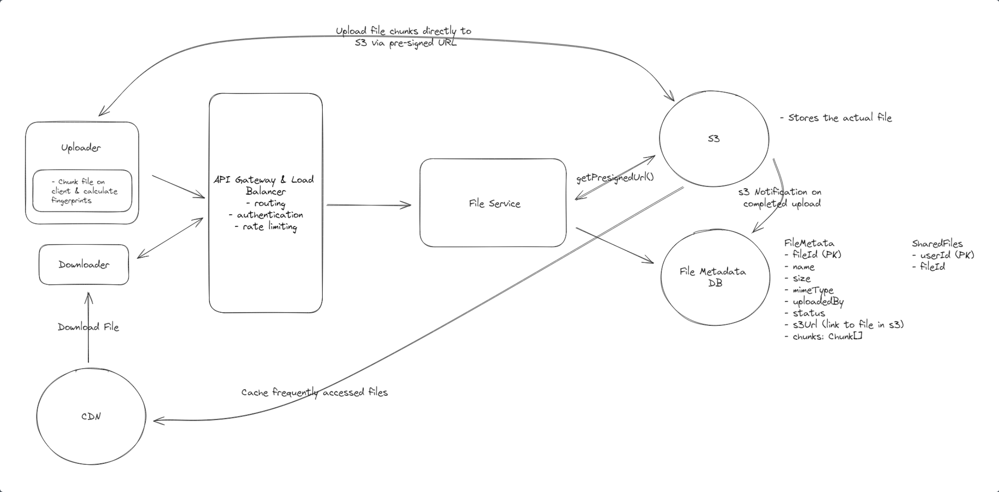

# Topics to cover
### Syncing across devices
  - Websockets for fresh files
  - Polling for stale files

### Resumable uploads and large files
  - Chunking and s3 event notifications

### Fast syncing
  - File compression

### Security
  - Encryption in transit and at rest
  - Access control
  - Presigned urls

[Dropbox](https://www.hellointerview.com/learn/system-design/problem-breakdowns/dropbox)
