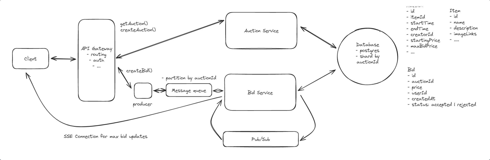

# Topics to cover
### Concurrent bids
  - We can just accept the bid and then show the user that they were outbid
  - Alternatively, store max bid and use locking (optimistic or pessimistic)

### Fault tolerance
  - Add a message queue for bids
  - Gives us durability and a way to buffer load spikes
  - Kafka can guarantee order (SQS doesn't)

### Always display the current highest bid
  - Server sent events or websockets and pub/sub

### Scalability
  - Partition message queue by auction id
  - Shard relational database by auction

[Source](https://www.hellointerview.com/learn/system-design/problem-breakdowns/online-auction)
