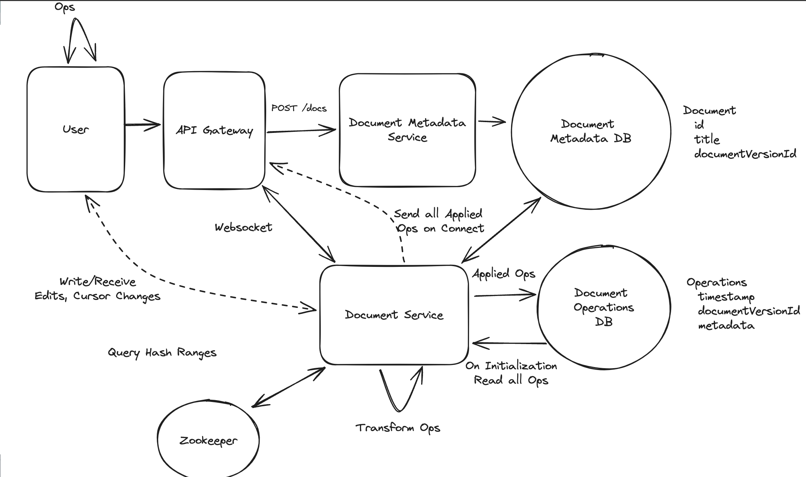

# Topics to cover
### Collaborative editing
  - Operational transform or CRDTs
  - OT requires central server to order and transform operations

### Millons of connections
  - Distribute load by document and use zookeper to track

### Optimize storage
  - Snapshot document or compact operations
  - Trade processor will tail the exchange's trades, check if it is an order from us and update the orders db

### Order consistency
- Store pending order -> submit to exchange -> update the external order id
- Background process to handle orders stuck in pending
- Cancels have a similar flow

[Source](https://www.hellointerview.com/learn/system-design/problem-breakdowns/google-docs)
