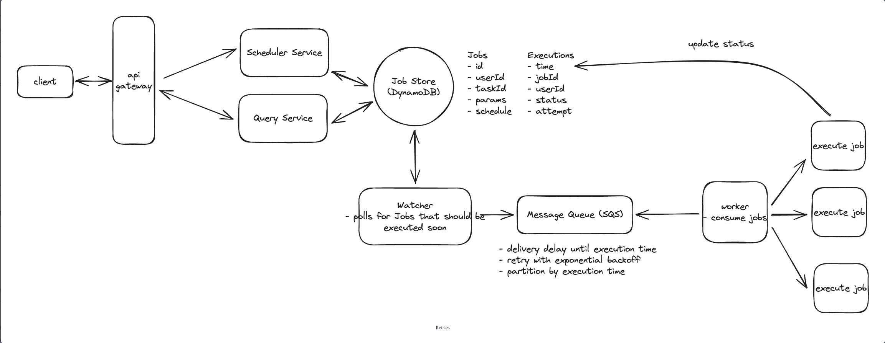

copied from [leetcode](https://leetcode.com/discuss/general-discussion/1082786/System-Design%3A-Designing-a-distributed-Job-Scheduler-or-Many-interesting-concepts-to-learn)

# Designing a distributed Job Scheduler

####

Functional requirements (can vary but I assume the following):

A job can be scheduled for one time or multiple executions (cron job) by other services/microservices
For each job a class can be specified which inherits some interface like IJob so that we can later call that interface method on the worker nodes when we execute the job. (That class can e.g. be present in a .jar file on the worker nodes).
Results of job executions are stored and can be queried
Non-function requirements (again, can vary but I assume the following):

Scalability: Thousands or even millions of jobs can be scheduled and run per day
Durability: Jobs must not get lost -> we need to persist jobs
Reliability: Jobs must not be executed much later than expected or dropped -> we need a fault-tolerant system
Availability: It should always be possible to schedule and execute jobs -> (dynamical) horizontal scaling
Jobs must not be executed multiple times (or such occurences should be kept to a minimum)

####

## Domain Analysis: Concepts

We can define the Domain Model that can later be converted into a Data Model (Database Model for Schema or a Model for ZooKeeper):

Job:
- Represents a Job to be executed
- Properties: Id, Name, JobExecutorClass, Priority, Running, LastStartTime, LastEndTime, LastExecutor, Data (Parameters)

Trigger (based on the concept Quartz Scheduler uses):
- Defines when a Job is executed
- We can define different Triggers like: OneTimeTrigger, CronTrigger
- Based on the type, we have properties like: Id, Type, StartTime, EndTime, OneTime, Cronjob, Interval

Executor:
- Is a single Job Executor/Worker Node
- Can have Properties like: Id (e.g. IP-based), LastHeartBeat

The multiplicity between Job and Trigger: Job--1-------*--Trigger (A Job can have multiple Triggers)

####

## High Level Design

Now, lets look at a high-level System Design diagram:

