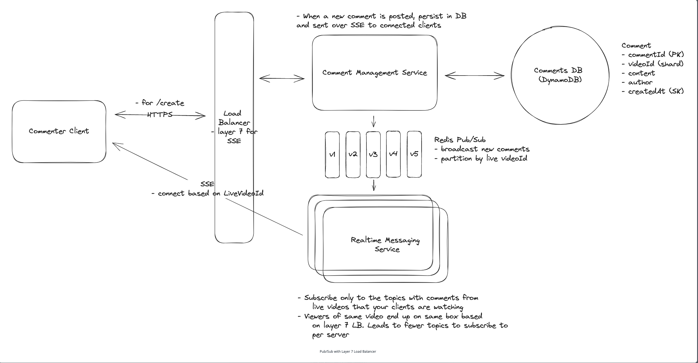

# Topics to cover
### Live updates
  - SSE or websockets
  - SSE is slightly better due to r/w ratio
### Handle 10M concurrent requests
  - Real time messaging service with Pub/Sub / dispatcher
  - Redis better than Kafka for dynamic subscriptions

[Source](https://www.hellointerview.com/learn/system-design/problem-breakdowns/fb-live-comments)
