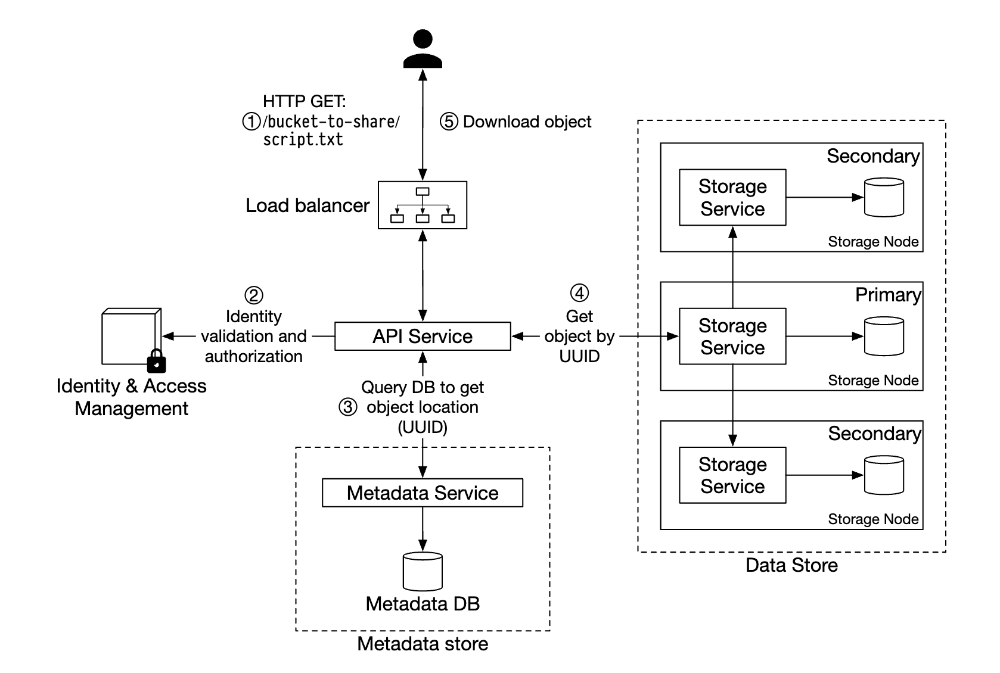

# Topics to cover
### Handle storage scaling
  - Horizontal scaling for storage nodes
  - Zookeeper to track cluster topology

### Resilience
  - Replication across multiple nodes (consistent hashing)
  - Consistency vs latency: async replication vs quorum writes

### Data organization on disk
  - Merge smaller files into bigger ones to reduce wasted disk space
  - Need to store object referencs with file offsets locally

### Durability
  - Multiple availability zones
  - Erasure coding (extension of RAID)
  - Checksums for file integrity

### Large file uploads
  - Multipart uploads
  - Datastore returns checksum
  - Client provides list of checksums at the end

### Garbage collection
  - Compaction
  - Copy good data to a new file and update the local DB records
