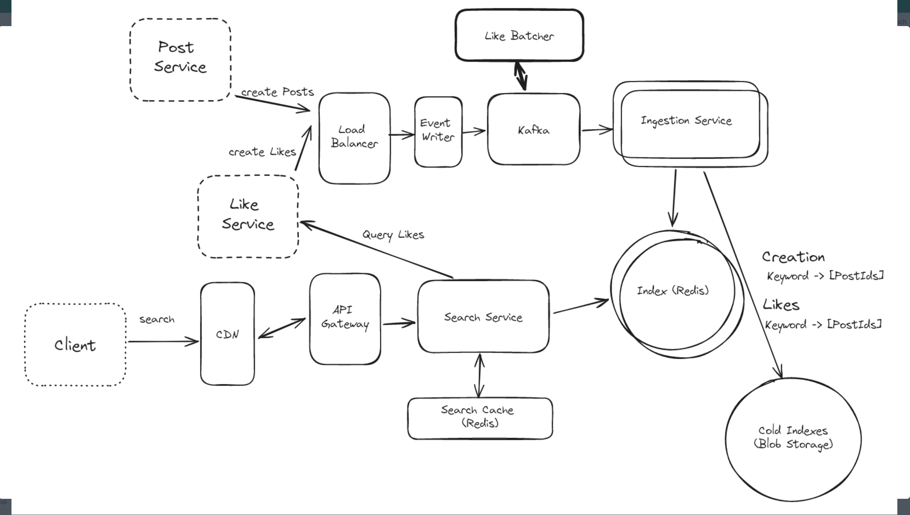

# Constraints
Not allowed to use full text search engine

# Topics to cover
- Search posts by keyword
  - Inverted index (keyword -> post id)
- Search by recency or like count
  - Multiple indices
- High request volume
  - CDN to cache at edge
  - Local cache
- Multi-keyword search queries
  - Shingles or n-grams
  - Store phrases or groupings of words in index
- Large write volume
  - Add a message queue for post ingestion
  - Two stage architecture for likes (approximate order)
- Improve on indices storage footprint
  - Limit number of results in indices
  - Move less frequent keywords to cold storage
