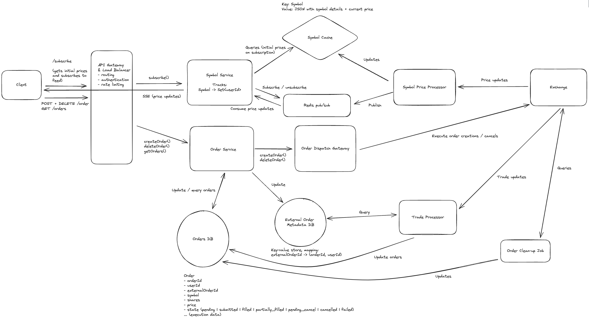

# Topics to cover
### Live price updates
  - Pub/sub (redis)

### Track order updates
  - Use an additional database like RocksDB to map from external_order_id -> (user_id, order_id)
  - Trade processor will tail the exchange's trades, check if it is an order from us and update the orders db

### Order consistency
- Store pending order -> submit to exchange -> update the external order id
- Background process to handle orders stuck in pending
- Cancels have a similar flow

[Source](https://www.hellointerview.com/learn/system-design/problem-breakdowns/robinhood)
