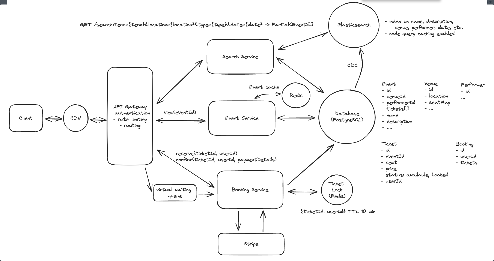

# Topics to cover
### Ticket reservation to prevent failed checkouts
  - Store the lock on the DB row with expiration
  - Distributed locks with TTL (redis)
### Handle 10M concurrent requests
  - Read heavy load -> caching
  - Horizontal scaling
### High demand events
  - Waiting queue -> limit concurrent users who can checkout
### Improve search latency
  - Dedicated full text search engine like Elasticsearch
### Frequent searches
  - Elasticsearch caching
  - CDN like cloudfront or fastly
