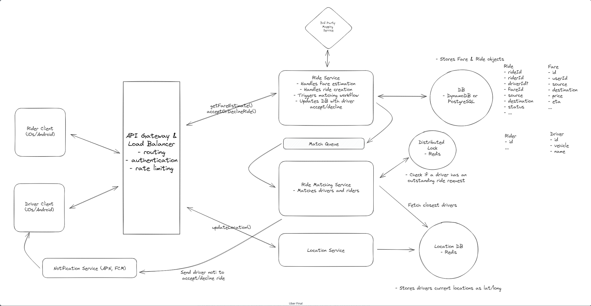

# Topics to cover

- Frequent drive location updates and proximity searches
  - In memory geospatial data store (geoshash)
- Ensure location accuracy in the face of high volume
  - Adaptive location updates
- Avoid simultaneous ride requests
  - Distributed lock with TTL (redis)
- Ensure request requests aren't dropped
  - Queueing system with horizontal scaling
  - Required acknowledgements on ride matching
- Improve performance and throughput
  - Geographic sharding and read replicas
