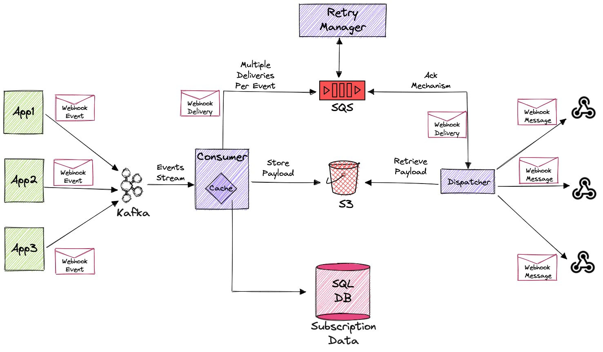

# Topics to cover
### Exactly once delivery
  - Idempotency keys
  - Failure retries
  - Exponential backoff can be achieved by scheduling meessages into the future
    - SQS has a 15 minute limit but can get around it with step functions or custom solutions
### Ordering
  - Don't guarantee order of events
### Fan out
  - Separate queues for event stream and webhook delivery

[Source](https://hackernoon.com/how-to-build-a-scalable-webhook-delivery-system-with-kafka-sqs-and-s3)
