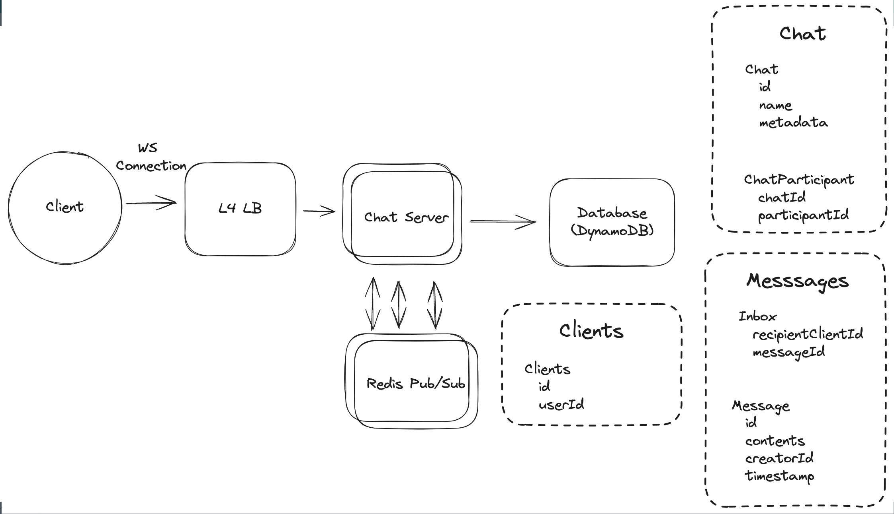

# Topics to cover

### Billions of concurrent users
  - Pub/sub - redis is a good solution for dynamically created topics

[Source](https://www.hellointerview.com/learn/system-design/problem-breakdowns/whatsapp)
