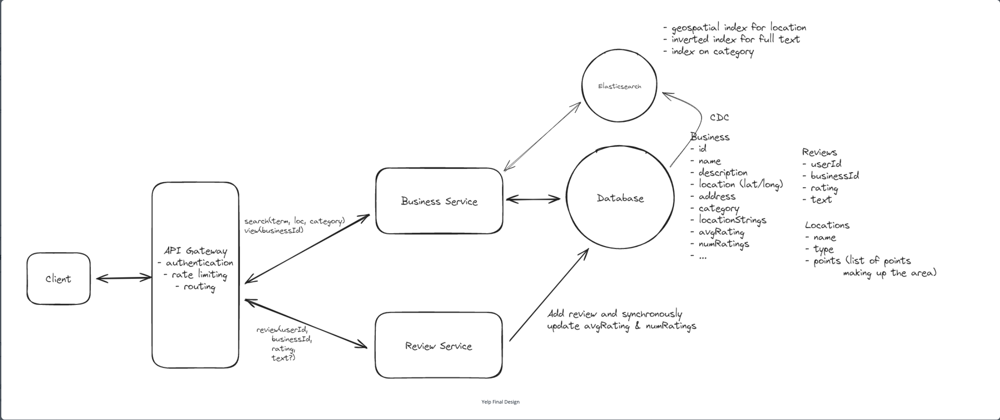

# Topics to cover
### Average business rating calculation
  - Compute averages synchronously using optimistic locking

### Enforce one review per user per business
  - Unique constraint at the DB

### Complex search queries
- Elasticsearch (eventual consistency)
- Postgres extensions (full text search and geospatial indices)

### Searching by location name
- Well known data sets with location name to polygons
- Elasticsearch and Postgres both can deal with this type of geographic polygon data

[Source](https://www.hellointerview.com/learn/system-design/problem-breakdowns/yelp)
